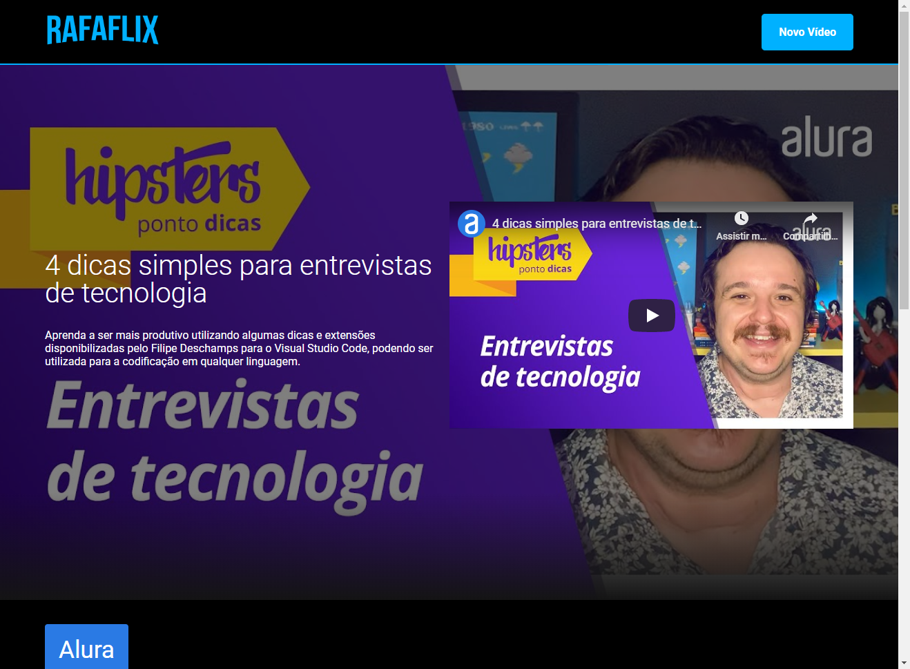

<p align='center'></p>
<h1 align='center'>RafaFlix - #ImersaoReact</h1>

<p align='center'>


</p>

<h3>🔖 Descrição</h3>
<p>Criação do AluraFlix, app web utilizando React na semana da #ImersãoReact da Alura.<p>

REACT
REACT ROUTE
REACT SLICK

<h3>ℹ️ Como usar</h3>
```bash
# Clone esse repositório
$ git clone https://github.com/rafaasimi/ImersaoGameDev.git

# Instalar dependências
$ npm install

# Execute
& npm start
```

<h3>🖼 Layout</h3>


<h3>📝 Licença</h3>
<p>O projeto se encontra sob licença MIT. Para mais detalhes, acesse <a href='LICENSE'>license<a>.</p>
<p>Criado com 💙 por <a href='https://github.com/rafaasimi/' target='blank'>Rafael Simionato</a></p>

